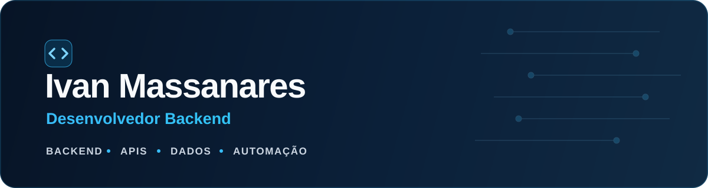

<p align="center">
  
</p>

<p align="center">
  <a href="https://www.linkedin.com/in/ivan-massanares/">
    
  </a>
  <a href="mailto:ivanmassanares@gmail.com">
    
  </a>
  
</p>

## Sobre mim

Sou desenvolvedor backend com foco em construir **APIs confiáveis**, integrações e sistemas orientados a regras de negócio. Trabalho principalmente com **Python, FastAPI e .NET**, explorando autenticação, mensageria, cache, bancos relacionais, testes automatizados e deploy com Docker.

- 🎓 Cursando **Ciência de Dados na FIAP**
- 🔐 Experiência prática com JWT, controle de acesso, rate limiting e idempotência
- ⚡ Interesse em arquitetura limpa, sistemas assíncronos e aplicações orientadas a eventos
- 🌎 Inglês fluente e francês intermediário

## Projetos em destaque

<table>
  <tr>
    <td width="50%" valign="top">
      <h3>🤖 <a href="https://github.com/Vanx-Mass/triageflow">TriageFlow</a></h3>
      <p>Triagem inteligente de atendimentos com IA, processamento em segundo plano e priorização em dashboard Blazor.</p>
      <p><code>.NET 10</code> <code>Blazor</code> <code>MySQL</code> <code>Transactional Outbox</code></p>
    </td>
    <td width="50%" valign="top">
      <h3>📨 <a href="https://github.com/Vanx-Mass/quoteflow">QuoteFlow</a></h3>
      <p>Acompanhamento automático do ciclo de vida de cotações a partir de e-mails, com backend .NET e interface React.</p>
      <p><code>.NET 10</code> <code>EF Core</code> <code>React</code> <code>Clean Architecture</code></p>
    </td>
  </tr>
  <tr>
    <td width="50%" valign="top">
      <h3>📦 <a href="https://github.com/Vanx-Mass/resilient-inventory">Resilient Inventory</a></h3>
      <p>Microsserviço orientado a eventos para evitar overselling de estoque em cenários concorrentes.</p>
      <p><code>Python</code> <code>Kafka</code> <code>Redis</code> <code>SQLite</code></p>
    </td>
    <td width="50%" valign="top">
      <h3>☁️ <a href="https://github.com/Vanx-Mass/triagem-suporte-ia">Triagem de Suporte com IA</a></h3>
      <p>Pipeline serverless na AWS para receber e classificar automaticamente tickets de suporte.</p>
      <p><code>Python</code> <code>AWS Lambda</code> <code>S3</code> <code>API Gateway</code></p>
    </td>
  </tr>
</table>

## Tecnologias

<p>
  
  
  
  
  
  
  
  
  
  
  
  
  
  
  
</p>

## O que você encontra por aqui

```text
APIs e serviços       -> autenticação, integrações, cache e resiliência
Dados e automação     -> pipelines, classificação e regras de negócio
Engenharia de software -> arquitetura limpa, testes e documentação
```

<p align="center">
  <sub>Aberto a oportunidades, colaboração e boas conversas sobre backend.</sub>
</p>
